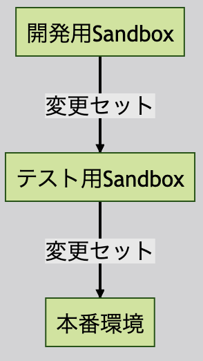

<!-- _paginate: false -->
<!-- theme: gradient class: blue-->
<!-- theme: freud class: blue-->

# DevOpsCenter について <!-- fit -->

 
 

##### スライド:https://tkonishi5515.github.io/devopsCenter/ja/index

##### リポジトリ:https://github.com/tkonishi5515/devopsCenter

---

# 初めに

- 深い箇所まで実践できていないため、現時点で私が理解している箇所を共有いたします
- 詳細な設定方法は説明しません

---

# トピックス

1. 現状の Salesforce のリリースとは？
2. DevOpsCenter とは？
3. DevOpsCenter でできること
4. DevOpsCenter と変更セット
5. DevOpsCenter の触り
6. 実践

---

# 現状の Salesforce のリリースとは？

- Salesforce の開発は下記のように、各環境間を変更セットでリリースを行うことが多い

---

# 現状の Salesforce のリリースとは？

## 変更セットの問題点

1. 必要なコンポーネントを手動で選択する必要がある
   - エクセルで管理すると漏れが出やすい
   - リリース先の環境で検証してみて初めて足りないことに気づくことも
2. バージョン管理不可
   - 誰がいつどのように修正したのかが、追えない
3. Salesforce の UI を通してリリースを行うため、自動化は難しい
   - CLI で変更セットをリリースは不可能

- **最近の開発サイクルから逸脱している**

---

# DevOps とは

- ソフトウェア開発（Development）と IT 運用（Operations）の間のコラボレーションや統合を促進する一連の実践と哲学のことです
- 開発と運用の両チームが一緒に働く文化やプロセスのことです
- 利便性を高めたい開発者と、安定的な運用をしたい運用者との間で、対立が生じた際に生まれました
  - 具体的に CI/CD をしようするなど
    

---

# DevOps Center とは

- 2022 年 12 月に正式リリース

- [Trailhead](https://trailhead.salesforce.com/ja/content/learn/modules/devops-center-quick-look/say-hello-to-devops-center?trailmix_creator_id=jimsharp&trailmix_slug=learn-dev-ops-center)に簡単に記載されている
- 恐ろしいことに「変更セットが気に入っている場合は、心配しないでください。現時点では廃止されません。」と記載されています

  - 将来的に変更セットを廃止する予定？

- [構成](https://help.salesforce.com/s/articleView?id=sf.devops_center_configure.htm&type=5)など設定方法は記載されているので、興味がある方は確認してみてください。

---

# DevOpsCenter でできること

- タスクの管理
  - DevOpsCenter 上でタスク(チケット)を作成し、成果物と結びつけることができる
- レビュー機能
  - GitHub と連携しているため、差分の確認が楽
  - 特に Apex や LWC を使用するプロジェクトでは、すごく楽になる
- リリース機能
  - ステージング環境や UAT 環境を設定しておき、修正した内容をリリースすることができる
  - 環境をメタデータで管理するため、デグレが起きにくい

※プロファイルは全量リリースであればできるかも、項目レベルセキュリティ 1 項目だけのリリースではエラーが出た(回避方法はあるかも)

---

# DevOpsCenter でできること

## ロードマップに記載されている今後追加予定の機能

- 各バージョン管理システム(Bitbucket,Gitlab など)のサポート
- 各作業管理ツール(JIRA,Agile Accelerator)との統合
- ビルトイン CI/CD
- ロールバック機能
- ホットフィックス機能
- 拡張性の向上

---

# DevOpsCenter と変更セット

- 相違点
  - ブランチ=開発環境のため、デグレが起きにくい
  - 開発環境で修正した箇所を自動で表示してくれるため、リリース漏れが起きにくい
  - GitHub 上でレビュー(PullRequest)をできるためレビューする人も簡単
  - アップロードなどは不要

---

# DevOpsCenter を行う際に必要なもの

- GitHub
  - 今回は個人のアカウントで行なっていますが、本格的に行いたい場合は会社で契約する必要あり
  - GitLab や BackLog の連携は今の所不可(BackLog 連携はシェア率的に厳しそう)
- Salesforce DX
  - 事前に設定しておく必要あり
- パッケージ
  - DevOpsCenter のパッケージをインストールする必要あり
- 接続アプリケーション
- 権限セット割当
- ブランチ戦略
  - プロジェクトが始まる前に用意しておくと良い

---

# DevOpsCenter を行う際に必要なもの

## ブランチ戦略とは

---

# DevOpsCenter を行う際に必要ないもの

- vsCode
  - 画面上でリリースや、マージを行うことができるため vsCode の設定は不要

---

# 実践

※これからお見せする DevOps Center は**本番環境のみ**構築可能です

---

# まとめ

- 変更セットより便利な箇所は多いがプロジェクトで使用するには、検討しなければいけない箇所がある
- GitHub の知識を完全に理解する必要はないが、ブランチの運用方法は考えておく必要がある
